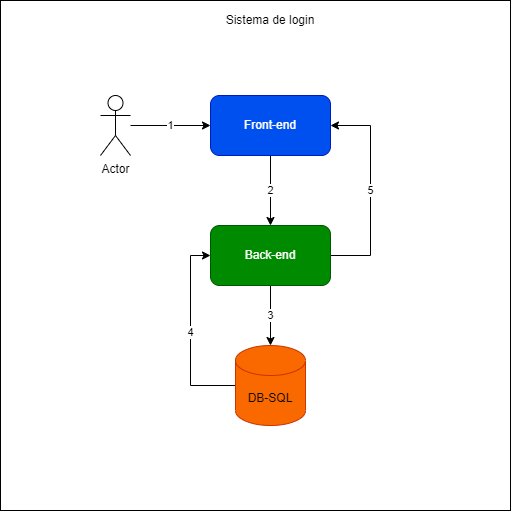

# Desafio_BigDataCorp
Fala pessoal! Beleza?
Irei descrever atraves de desenhos tecnico o passo a passo de como funcionaria a compra de ingressos em um site.

### Sistema de login
 O cliente acessou o site, e o mesmo precisa de um login para poder realizar a compra do ingresso.
 

* passo 1: o  cliente digitou suas credenciais
* passo 2: o front end mandou essas informacoes digitadas para o back-end (API).
* passo 3: o back-end (API) vai validar essas informacoes em banco.
* passo 4: após os dados validados tem o retorno de informações do banco.
* passo 5: o back end retorna um HTTP code 200 para o front e assim liberando o acesso retornando tambem um JWT.

### Compra de ingressos 
 Após relizar o login, o cliente ira acessar a aba de compra ingressos.
 

* passo 1: o cliente foi para pagina de ingressos e clicou em inciar compra
* passo 2: apos clicar em iniciar compra o back-end vai verificar se existe ingresso disponivel e atachar o id do cliente na tabela de ingresso para garantir que não pegaram o ingresso por terem uma internet mais rapida, e tera um timer de 10 min para poder finalizar a compra caso extourar o tempo, o ingresso volta a ficar disponivel.
* passo 3: valida de existe ingresso dispónivel e e faz um update na tabela de ingressos.
* passo 4: Retorno do banco de dados com sucesso.
* passo 5: o back end retorna um HTTP code 200 para o front e assim liberando o acesso para a proxima pagina de preenchimento.

### Finalizar compra 
 Após relizar a escolha dos ingressos, o cliente ira acessar a aba de confirmamento da compra.
 

* passo 1: o cliente acessa o tela de confirmamento da compra digitando seus dados e forma de pagamento.
* passo 2: o  back-end recebe um requisição http.
* passo 3: atualiza o status do pagamento no banco para aguardando o pagamento do ingresso desse cliente
* passo 4: publica a informação em um tópico.
* passo 5: o servico de pagamento consome essa informacao do tópico.
* passo 6: o servico chama uma api externa de pagamento.
* passo 7: a api externa retorna o status do pagamento para o servico.
* passo 8: o servico de pagamento altera o status do pagamento no banco, se foi realizado com sucesso ou não.

